# Monde Sinxi - Skills Test Report

## Setup

`python -m venv env`

`pip install -r requirements.txt`

## Task 1: Classifying the document

### Methodology

We use three methods for genrating vectors to feed into the models

#### Data Preparation

1. Remove symbols, numbers, extra spaces and puctuation. Make all text lower case.
2. Lemantize all words to reduce all words to only their roots.
3. Remove all stop words.

The labeled data is evenly distributed, i.e there is an equal amount of representation of the two classes in the data set. Splitting the data into a test and 

#### Tokenization Methods

* Bag-of-words: Use `CountVectorizer` from `sklearn.feature_extraction.text`, which performs a raw count of the number of tokens are present in the corpus. Each document is represented by a sparse vector
  
* TF-IDF: Use `TfidVectorizer` from `sklearn.feature_extraction.text`, a combination of `CountVectorizer` and `TfidTransform`. Also performs vectorization of text, however, any words repeated across documents have a reduced contribution to the vector, giving more unique tokens a higher degree of representation in the document vector.
  
* Word embedding (word2vec): Each word is converted to a vector. Conversion could be trained from the available text or use a pre-trained model could be used to assign vectors. For the entire document, the average vector is obtained to feed into the models. For this report we use a pre-trained model from `Glov` that was trained from 2 billion tweets.

#### Classification Models

* Naive Bayes
* SGD linear
* Logistic Regression
* Decision Tree
* Randon Forrest
* Neural Network
* Neural network with word embedding

### Results

We find that the best performing model/tokenization method is the decision Tree model coupled with TF-IDF, which is followed closely by using the same model with a bag-of-words approach. Using word embedding with a neural network also gives good results

#### F1-score

|  | Naive-Bayes | SGD (linear SVM) | Logistic Regression | Decision Tree | Random Forrest | Neural Network | 
| ----- | -----  | ----- | ------ | ------ | ------ | ------ |
| BOW | 0.81 | 0.93 | 0.95 | 0.97 | 0.90 | 0.93 |
| TF-IDF | 0.76 | 0.91 | 0.93 | 0.98 | 0.90 | 0.88 |
| word2vec | **N/A** | 0.51 | 0.67 | 0.67 | 0.70 | 0.65 |
| embedding | -- | -- | -- | -- | -- | 0.96 |

Note - cannot used word2vec with Naive-Bayes, cannot accept negative values in the vector.

#### Plots of confusion matrices

Here we present visualizations of the confusion matrices. These are graphic representations of the performance of the classification models.

**Naive Bayes**

*Bag-of-words*

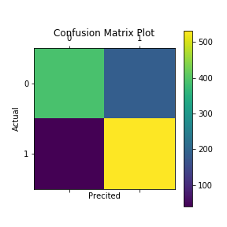

*TF-IDF*

<!--  -->

**SVM Linear**

*Bag-of-words*

*TF-IDF*

*word2vec*

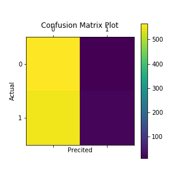

**Logistic Regression**

*Bag-of-words*

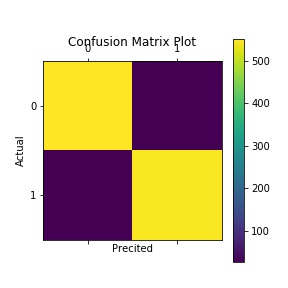

*TF-IDF*

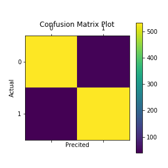

*word2vec*

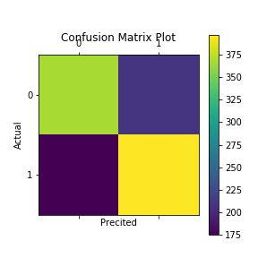

**Decision Tree**

*Bag-of-words*

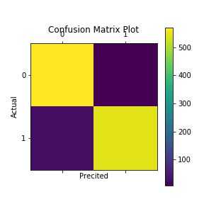

*TF-IDF*

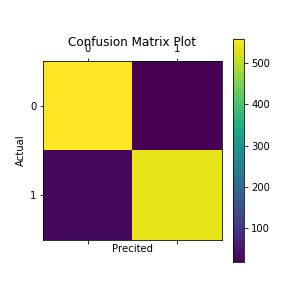

*word2vec*

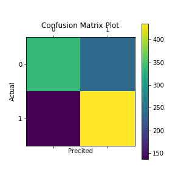

**randon Forrest**

*Bag-of-words*

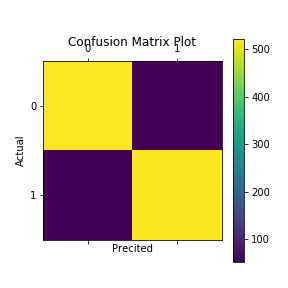

*TF-IDF*

*word2vec*

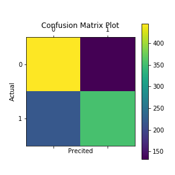

<!-- ![alt text][figures/nn_bow.png]
![alt text][figures/nn_tfidf.png]
![alt text][figures/nn_w2v.png] -->

#### Selecting the best model/tokenization

## Task 2: Data Exploration and Insights

Here we explore the data, looking for any insights and interesting features. We'll start by looking for frequent terms in the text, perform a sentiment analysis and attempt to extract topics. We'll also perform a clustering analysis with k-means to further explore categories.

### Frequent Terms

We report results of the raw counts of unigrams, bigrams and trigrams.

#### Unigram

As expected terms such as "Fargo", "Bank" and "account" feature prominently in the histogram. The most popular term after these terms is "fee". This is an indicator that issues related to fees are prominent in the public discusions. Terms such as "customers", "overdraft", "loan", "mortgage" and "cash" are also part of the top terms mentioned. 
#### Bigram

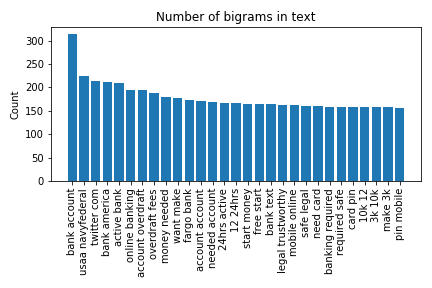

Terms such as "account overdraft" , "overdraft fees" appear, supporting our interpretation from the unigram histogram, that fees are an important part of the public disussion.

Note: removed "Wells Fargo from histogram"

#### Trigram

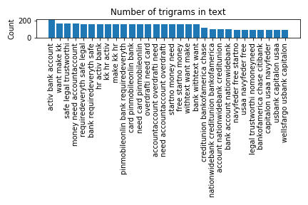

One of the interesting features from the trigram is the term "Safe legal trustworthi", which is the third highest count in the trigram 

### Sentiment Analysis

The `Vader` library wrapped in `sklearn` is used to perform a sentiment analysis. There exists a lexicon in `vader` that coumpunds the individual contributions of words to determine the components that convey sentiment i.e positive, negative and neutral. 

Performing a sentiment analysis on all text and binning the compunded sentiment score produces the below figure

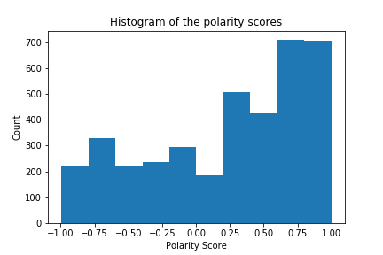

There are examples where the sentiment is clearly favorable to Wells Fargo. However more complicated examples such as the one below may be favourable statements (compound sentiment of 0.9169), but are clearly not favourable to Wells Fargo itself.

> Wells fargo overdraft fees? I know my savings account on 20k cash is only giving me 1 dollar a month in interest You may want to consider another bank for your savings account, 1% interest isn't too hard to find and would get you 16-17 dollars a month instead. Ally Bank is the most common one I see thrown around, mainly due to the easy movement of cash in and out of their accounts.

There is also a weakness in using the model for extracting sentiment when using all the words in the sentence, where the following 
> on Wells fargo overdraft fees? Your question is not stupid. Wells Fargo is ruthless and at best, amoral

has an overall compund score of 0.8114, which is clearly not accurate.

We can look to extract more meaningful sentiment by identifying ony the necessary parts-of-speech. We can start by tagging words in sentences and search for only JJ, JJR, JJS, VBD, VBN, NN  and then perform the sentiment analysis. The above sentence becomes

> fargo overdraft question stupid ruthless best amoral

which now appropriately has a negative sentiment with a compunded score of -0.2023

Applying this extraction of relevant tags and calculating the sentiment we obtain a significantly different distribution of sentiment (see below).

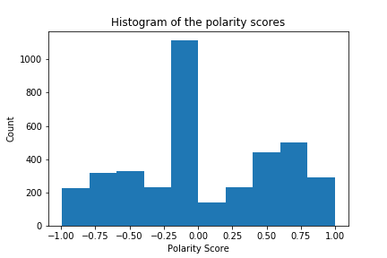

This distribution is no longer skewed towards a positive sentiment. Most of the scores that are calculated are classified neutral (between -.025 and 0.25), otherwise the sentiment tends to be quite polar

If we filter text that includes the term "fees" and apply the same procedure to extract sentiment we produce the following sentiment

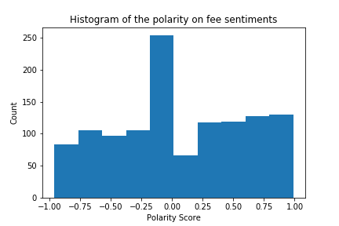

We get a less polar more evenly distributed sentiment (when the large neutral count is exluded).

### Topic Extraction

The `LatentDirichletAllocation` module from `sklearn.decomposition` was used to extract the underlying topics from text. 

The following table lists the top words selected for each Topic from the model

removed "wellsfargo", "like", "said", "im"

|Topics |Top terms|
|-----|----|
| Topic 1 |loan fargo rate mortgag credit home auto year car bank busi fee student hous offer work lender borrow financi time |
| Topic 2 | fargo bank custom account million fee employe compani xxxx pay year charg open servic sale scandal state ceo financi |
| Topic 3 | bank need usaa wellsfargo chase account citibank money usbank creditunion navyfeder activ bankofamerica make want seriou hr legal free capitalon |
| Topic 4 | fargo account fee bank check card credit charg money overdraft use pay open cash dont time servic close |
| Topic 5 | fargo account fee bank check card credit charg money overdraft use pay open cash dont time servic close
 |
Although it is not straigtforward we can infer meaning to some of these topics

Topic 1: Related to loans
Topic 2: 
Topic 3: Reoccuring promotional tweet. Not directly related to Wells Fargo, but seems to be a microlender that prefers to lend to the banks listed.
Topic 4: Related bank charges and overdraft fees
Topic 5: Related to fees and overdraft

### Unsupervised Learning - Clustering Analysis

From `sklearn.cluster` we use the `KMeans` module to perorm clustering of text. 
We expect to return similar results from the topic extraction performed with the `LatentDirichletAllocation` module. 

|Clusters |Top terms|
|-----|----|
| Cluster 1 | fargo bank account fee custom charg million credit check loan open said servic rate card money pay mortgag payment|
| Cluster 2 |  rate report fargo share price object th april upgrad reiter use chase best upsid need toyota subprim know work money|
| Cluster 3 |  loan auto car credit bad refin rate refinanc financ bank use chase best upsid need toyota subprim know work money|
| Cluster 4 | bank need usaa chase citibank creditunion navyfeder wellsfargo usbank account money cash activ make trustworthi legal free capitalon|
| Cluster 5 | fargo bank fee account wellsfargo rt year rate money like credit charg custom pay compani card loan mortgag time make|

Cluster 1 and 5: Related to fees and bank charges

Cluster 2: related to the the financial makrket

Cluster 3: Related to loans

Cluster 4: Reoccuring promotional tweet. Not directly related to Wells Fargo, but seems to be a microlender that prefers to lend to the banks listed.

### Summary of insights

Fees feature prominently in both methods of clustering for topics. The histograms of the n-gram counts supports these results. The methods for classifying sentiments could be improved by either adding tags that were filtered out, using another lexicon other than Vader's or training a model of tagged sentiment. The discussion around Wells Fargo is not favourable

## Useful Resources

https://towardsdatascience.com/multi-class-text-classification-model-comparison-and-selection-5eb066197568

https://realpython.com/python-keras-text-classification/

https://towardsdatascience.com/a-complete-exploratory-data-analysis-and-visualization-for-text-data-29fb1b96fb6a

https://blog.acolyer.org/2016/04/21/the-amazing-power-of-word-vectors/

https://stackabuse.com/implementing-word2vec-with-gensim-library-in-python/

https://www.kaggle.com/mf34richard/word2vec-logistic-regression-0-88-auc

Natural Language Processing with Python by Steven Bird, Ewan Klein & Edward Loper

Python Data Science Handbook by Jake vanderPlas